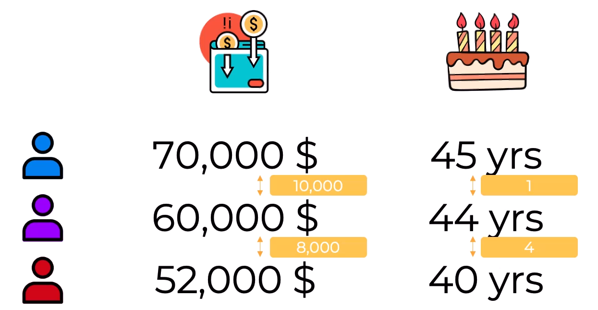
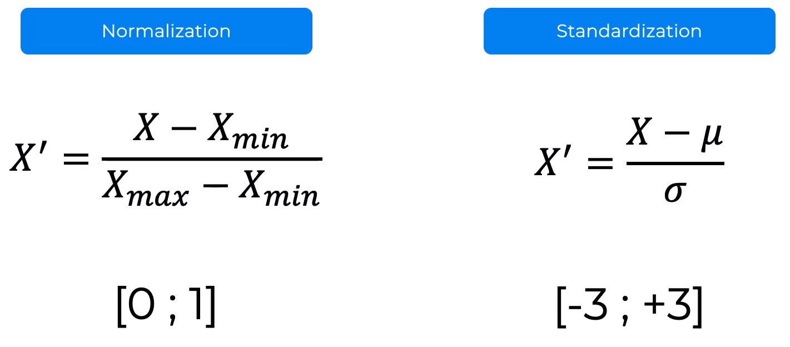

# Data preprocessing 🧑‍💻

The very first step in any data science project is to preprocess the data. This is the step where we clean the data, remove outliers, and prepare the data for the next steps. 

## Steps:
``` diff
- Importing the libraries
- Importing the dataset

+ Taking care of missing data

- Encoding categorical data:
+ Encoding the Independent Variable
+ Encoding the Dependent Variable

- Splitting the dataset into the Training set and Test set

+ Feature Scaling
```

---


## Installing the libraries

```bash
# numpy for the matrix manipulation & working with numbers efficiently
# pandas for the data manipulation
# matplotlib for the data visualization (drawing graphs & charts)
# scikit-learn for the machine learning models
pip install numpy pandas matplotlib scikit-learn
```

---

## Importing the libraries

```python
# Importing the libraries
import numpy as np
import matplotlib.pyplot as plt
import pandas as pd
```

---

## Importing the dataset

- The dataset is a CSV file, so we use the `read_csv` method from the `pandas` library to import the dataset.
- The `iloc` method is used to select the rows and columns of the dataset. The `:` means that we want to select all the rows, and the `:-1` means that we want to select all the columns except the last one. The `:` means that we want to select all the rows, and the `-1` means that we want to select the last column.
- The `values` method is used to convert the data into a numpy array.

```python
# Importing the dataset
dataset = pd.read_csv('Data.csv')
X = dataset.iloc[:, :-1].values
y = dataset.iloc[:, -1].values
```

---

## Taking care of missing data

To handle missing data, we can either **remove the rows** that have missing data, or we can **replace the missing data with the mean of the column**. There're also many other ways to handle them, but these two are most famous.

- To handle missing data, we use the `SimpleImputer` class from the `sklearn.impute` library.

```python
from sklearn.impute import SimpleImputer

# make an instance of the SimpleImputer class, and pass the missing_values and strategy arguments to it.
imputer = SimpleImputer(missing_values=np.nan, strategy='mean')

# we're not going to fit the imputer to the whole dataset, because the first column is categorical data.
imputer.fit(X[:, 1:3])
X[:, 1:3] = imputer.transform(X[:, 1:3])
```

---

## Encoding categorical data (any value that is not a number) 🎸

### Encoding the Independent Variable (when there is no order between the categories, like, countries, names, etc.)

For handling such cases, we use '**onehot encoding**', which essentially is just converting that column into as many columns as there are categories, and then assigning a 1 or 0 to each of those columns, depending on whether the row belongs to that category or not.

```python
# we will need column transformer because we need to transform the columns
from sklearn.compose import ColumnTransformer
from sklearn.preprocessing import OneHotEncoder

# column transformer takes a list of tuples as an argument. Each tuple has 3 arguments:
# 1. name of the transformer
# 2. the transformer
# 3. the columns that we want to transform

# We also need to state to do with the rest of the columns that we don't want to transform. We can either drop them or leave them as they are. We will use the 'remainder' argument for that.
ct = ColumnTransformer(transformers=[('encoder', OneHotEncoder(), [0])], remainder='passthrough')
X = np.array(ct.fit_transform(X))
```

### Encoding the Dependent Variable (when there is an order between the categories, like, yes/no, good/bad, etc.)

For handling such cases, we use '**label encoding**', which essentially is just converting that column into a single column, and then assigning a number to each of those categories (0,1,2, etc).

```python
from sklearn.preprocessing import LabelEncoder
le = LabelEncoder()
y = le.fit_transform(y)
```

---

## Splitting the dataset into the Training set and Test set

```python
# passing the test_size argument to the train_test_split method, we can specify the percentage of the dataset that we want to use for testing.

# passing the random_state argument to the train_test_split method, we can specify the seed for the random number generator, so that we can get the same results every time we run the code.

from sklearn.model_selection import train_test_split
X_train, X_test, y_train, y_test = train_test_split(X, y, test_size = 0.2, random_state = 1)
```

---

## What is feature scaling?

Feature scaling is when we change the values of numeric columns in the data so that they all have the same range. This is important because some machine learning models are based on calculations, and if the values in the data are very different, then the calculations will be based on the values with the largest range. This means that the values with the smallest range will have little effect on the model, even though they may be important. To avoid this problem, we can change the values so that they all have the same range.

#### For example:



If we're asked, the violet person is closer to whom? The blue person or the red person?

If we only look at the difference in numbers, we might overvalue the income column, and think the violet person's income is closer to the red person's income than the blue person's income. But if we look at the difference in age, we can see that the violet person's age is actually much closer to the blue person's age.

##### We just can't compare the age and income columns directly, because they have different ranges. We need to change the values so that they all have the same range.

Hence, we use feature scaling.

- Two types of feature scaling:
  - **Min-max scaling (normalization)**: values are shifted and rescaled so that they end up ranging from 0 to 1.
  - **Standardization**: values are shifted so that they have a mean of 0 (this does not affect the distribution of the values), and are then scaled so that they have a standard deviation of 1 (this makes the values all have the same range).



```Normalization works good when the distribution is a normal distribution, and standardization works good distribution is all the time.```

So, we'll mostly use standardization.

- We will use `StandardScaler` class from the `sklearn.preprocessing` library to do the feature scaling.

- **Feature scaling is applied only to the train data, it is not applied to the test data (as it is something that is supposed to be coming later on only).**

- **Feature scaling is not applied to the dummy variables (the ones that we created using onehot encoding).**

```python
from sklearn.preprocessing import StandardScaler
sc = StandardScaler()

# we're not going to fit the scaler to the whole dataset, because the first three column is categorical data onhot encoded.
X_train[:, 3:] = sc.fit_transform(X_train[:, 3:])
X_test[:, 3:] = sc.transform(X_test[:, 3:])

```

### === X ===