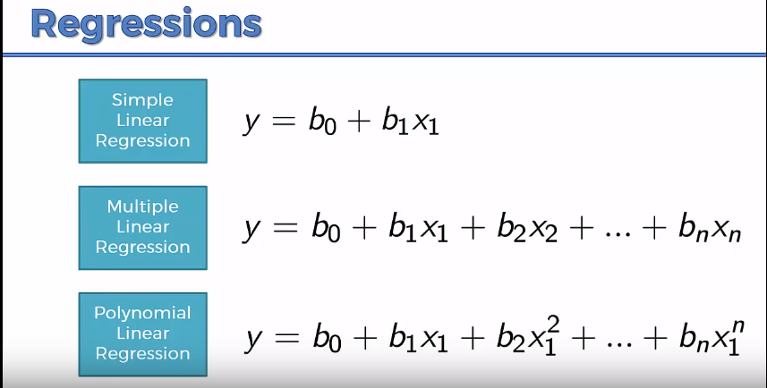

# Polynomial Linear Regression

Equation of a **polynomial linear regression** is:


- Even though the equation looks like a polynomial equation, it is a linear equation.

- The equation is linear because the coefficients are linear.

- **In polynomial regression, the independent variable is raised to a power, and the coefficients of these powers are estimated by the model. The resulting equation may have terms that are quadratic, cubic, or higher-order, but it is still considered a linear model because the coefficients can be estimated using linear regression methods.**

---

## Polynomial Regression - A special case of Multiple Linear Regression

- From a single independent variable, we can create multiple new independent variable by raising it to a power.

- And, then we can use these new independent variables to create a polynomial linear regression model.

```python
from sklearn.preprocessing import PolynomialFeatures
poly_reg = PolynomialFeatures(degree = 4)
X_poly = poly_reg.fit_transform(X)
print(X)
print(X_poly)
lin_reg_2 = LinearRegression()
lin_reg_2.fit(X_poly, y)
```

## Visualizing the Polynomial Regression results (for higher resolution and smoother curve)

```python
X_grid = np.arange(min(X), max(X), 0.1)
X_grid = X_grid.reshape((len(X_grid), 1))
plt.scatter(X, y, color = 'red')
plt.plot(X_grid, lin_reg_2.predict(poly_reg.fit_transform(X_grid)), color = 'blue')
plt.title('Truth or Bluff (Polynomial Regression)')
plt.xlabel('Position level')
plt.ylabel('Salary')
plt.show()
```

--- 

### Extras:

```python
# to get the intercept
print(lin_reg_2.intercept_)

# for retrieving the slope:
print(lin_reg_2.coef_)

# predict for a single value
print(lin_reg_2.predict(poly_reg.fit_transform([[6.5]])))

```