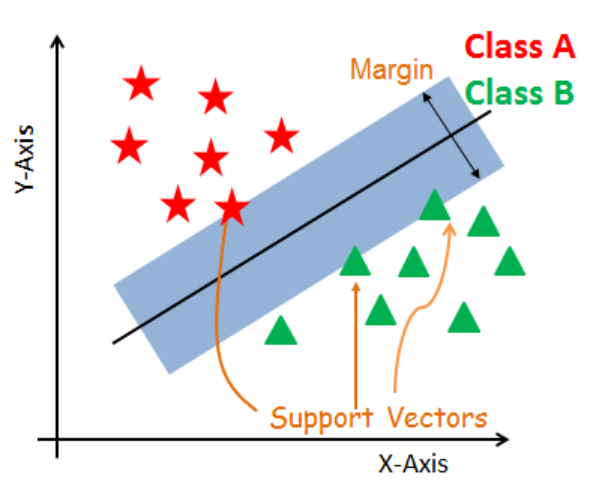

# Support vector regression (SVR) 🚀

- **This is the one regression model, where we will need to do `feature scaling`.**

- The SVR model is a `non-linear` model, which means that it can capture `non-linear relationships` between the dependent and independent variables.

- It is based on the idea of `fitting the error` within a certain `tolerance`.



- There is a line describing the `best-fit line` and the `buffer region` is describing `tolerance for the error`. 
- Points within the buffer region are not considered as errors. 
- Points outside the buffer region are considered as errors. But, their error is not taken from the best-fit line, but from the just below/above vertical point on the buffer region.

---

### It will be best understood after SVM (Support vector machine) is understood. 😁

---

## Steps:

- Importing the libraries
- Importing the dataset
- Cleaning the dataset
- Splitting the dataset into the Training set and Test set
- Apply Feature Scaling on the training set
- Training the SVR model on the Training set
- Feature scale the testset
- Predicting the results on the feature scaled test set
- Inverse transform the predicted result to normal values

---

``` python
# feature scaling
from sklearn.preprocessing import StandardScaler
sc_X = StandardScaler()
sc_y = StandardScaler()
X = sc_X.fit_transform(X)
y = sc_y.fit_transform(y)
```

```python
# training the SVR model
from sklearn.svm import SVR
regressor = SVR(kernel = 'rbf') # rbf is the Radial Basis function (RBF). It is the most popular kernel function.
regressor.fit(X, y)
```

```python
# predicting the results
sc_y.inverse_transform(regressor.predict(sc_X.transform([[6.5]])).reshape(-1,1))
```