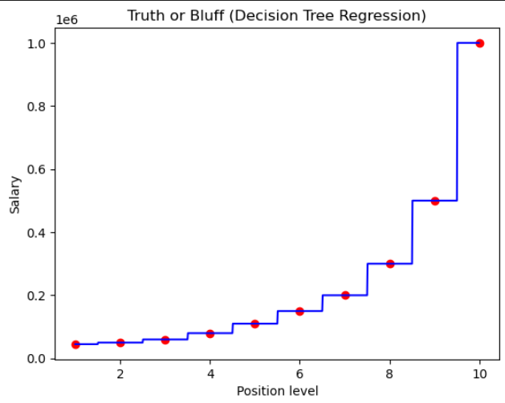

# Decision tree regression 🌲

 A Decision tree is a flowchart-like tree structure, where each internal node denotes a test on an attribute, each branch represents an outcome of the test, and each leaf node (terminal node) holds a class label.


- Split the dataset into multiple subsets.
- Split the subsets into multiple subsets.
- Continue this process until the subsets are pure.
- The subsets are pure when they contain only one class of data.
- Then generate a decision tree based on the subsets.
- **When a new data point comes, it will be classified based on the decision tree, and to which ever class it falls into, the average of all the data points in that class will be the predicted value.**

---

### A sample decision tree graph


**Note** => It returns the average value of all the other points in that region/subset.

---

#### It works best when the dataset is non-linear, and there're multiple features.

#### We won't need to apply feature scaling in this model.

---

## Code:

```python
from sklearn.tree import DecisionTreeRegressor
regressor = DecisionTreeRegressor(random_state = 0)
regressor.fit(X, y)
regressor.predict([[6.5]])
```