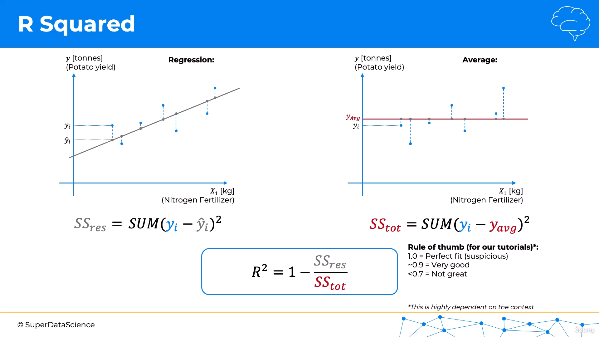
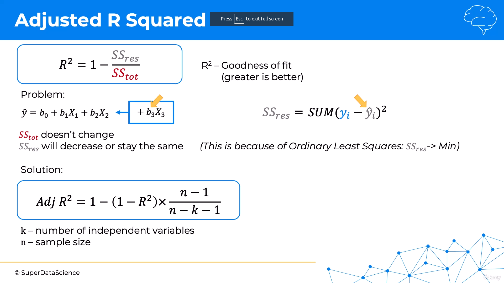
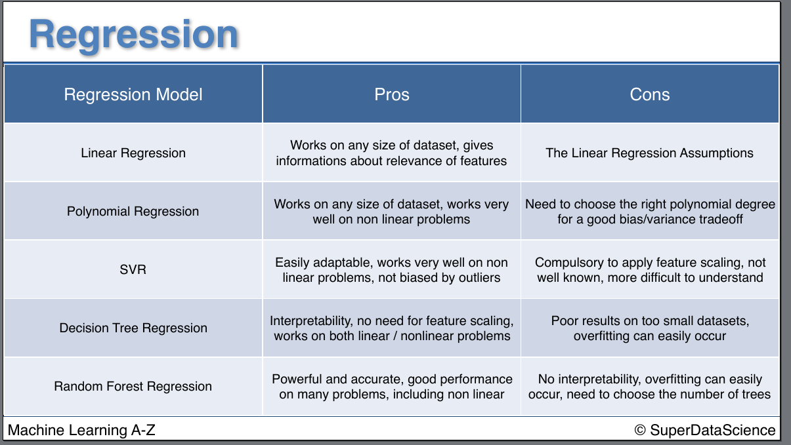

# Evaluating regression model performance 💃

- ## R-squared

- R-squared is a statistical measure of how close the data are to the fitted regression line.
- It is also known as the **coefficient of determination**, or the **coefficient of multiple determination for multiple regression**.




### Rule of thumb:

Value of **R-squared**:
- **1.0 = Perfect fit (suspicious)**

- **~0.9 = Very good**

- **<0.7 = Not great**

- **<0.5 = Bad**

- **<0 = Very poor**

## code:

```python
from sklearn.metrics import r2_score
r2_score(y_test, y_pred)
```

---

- ## Adjusted R-squared:



- If you add more features to your model, the R-squared value will always increase.

- This is because the model has more terms to fit the data. Clearly, this is not a good thing. We want to add features to our model that actually improve the model, not just make it fit the data better.

- To compensate for this, we use the adjusted R-squared. The adjusted R-squared will only increase if the new term improves the model more than would be expected by chance.

---


# How to choose the best model?

- Simply, use all the models you can and compare the **r-squared values**.

- The model with the highest r-squared value is the best model.

## Pros and cons of the different models:
