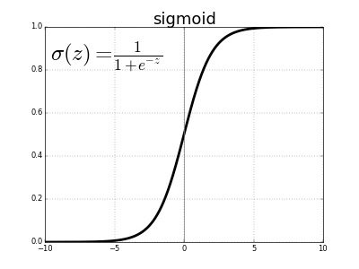
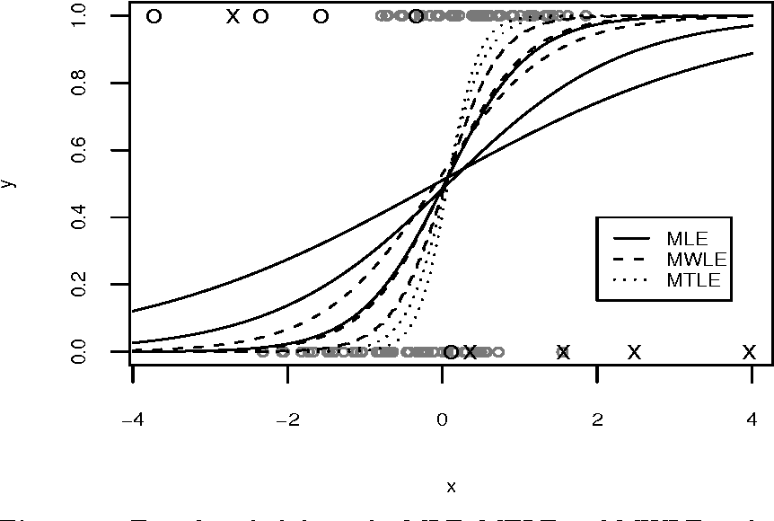

# Logistic Regression

## Introduction

- Logistic regression is a classification algorithm.
- It is a `linear classifier`. 
- It is used to predict a binary outcome (1 / 0, Yes / No, True / False) given a set of independent variables.
- In logistic regression, the dependent variable is a binary variable that contains data coded as 1 (yes, success, etc.) or 0 (no, failure, etc.).

## Logistic Regression Assumptions

- Binary logistic regression requires the dependent variable to be binary.

- Only the meaningful variables should be included.

- The independent variables should be independent of each other. That is, the model should have little or no multicollinearity.

---

## Sigmoid Function

- The sigmoid function, also known as the logistic function, is a mathematical function having a characteristic "S"-shaped curve or sigmoid curve.

- Its values range from 0 to 1, and it is defined by the formula:

---

## Maximum Likelihood Estimation

- **We have a logistic curve thats fitting our data, but how do we find the best fitting curve? 🤔**

- Just like, in case of **linear regression, we have a cost function (square distance from real value) that we minimize to find the best fitting line**.

- In case of **logistic regression, we have a cost function that we minimize to find the best fitting curve**.

- The cost function is called **Maximum Likelihood Estimation**.

#### likelihood:

- We find the probability for each data point to be in the class 1 or 0, and then we multiply all the probabilities together. This value is called `likelihood`.

- Then, we draw all such possible curves and find the curve that gives us the maximum likelihood.

---

## Linear Regression Vs Logistic Regression

---

## Confusion matrix 😕

- [Youtube video](https://www.youtube.com/watch?v=AyP85ocS-8Y) for confusion matrix.

- A confusion matrix is a table that is often used to describe the performance of a classification model (or "classifier") on a set of test data for which the true values are known.

- **True Positive (TP):** We predict a label of 1 (positive), and the true label is 1.

- **True Negative (TN):** We predict a label of 0 (negative), and the true label is 0.

- **False Positive (FP):** We predict a label of 1 (positive), but the true label is 0. Also known as a **"Type I error"**.

- **False Negative (FN):** We predict a label of 0 (negative), but the true label is 1. Also known as a **"Type II error"**.

- **Accuracy:** Overall, how often is the classifier correct.

---

