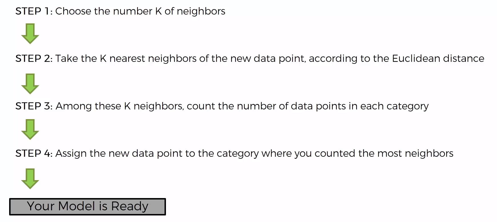
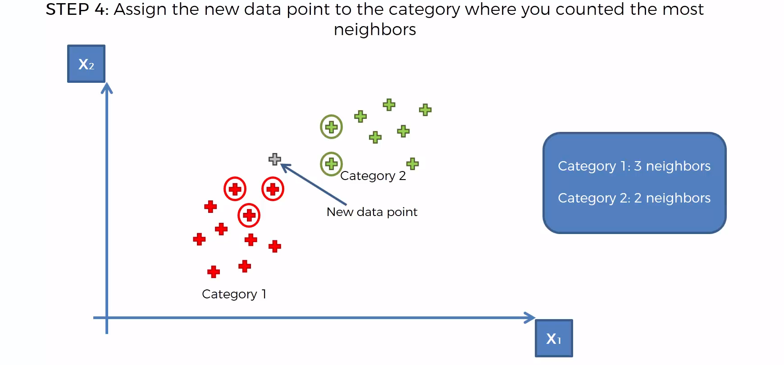

# K-Nearest Neighbors 🤠

- A classification algorithm that uses the **K** nearest neighbors to classify a new data point.

- The **K** is a hyperparameter that you have to choose.

- The **K** is usually an **odd number**. Generally, **K** is a small number like 3, 5, or 7.

## How does it work?

- The KNN algorithm assumes that similar things exist in close proximity. In other words, similar things are near to each other.

- The KNN algorithm uses this principle to predict the class of a new data point.

- The KNN algorithm identifies the **K** nearest data points to the new data point, based on the Euclidean distance.

- The KNN algorithm then assigns the new data point to the class that is most common among its **K** nearest neighbors.

* The KNN algorithm is a **lazy learner** because it **does not learn a discriminative function from the training data**, but **memorizes the training dataset instead**.

