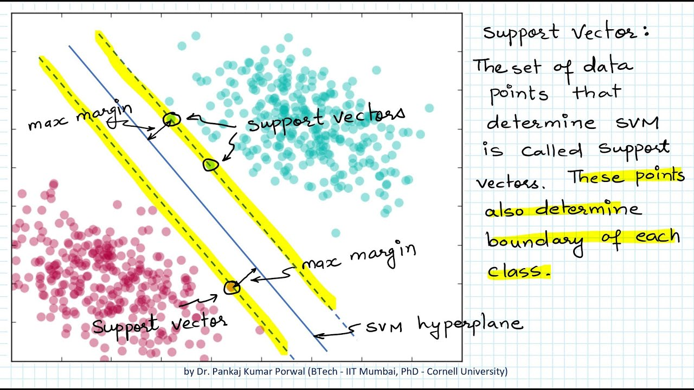

# Support Vector Machine

## What is SVM?

- Support Vector Machine (SVM) is a supervised machine learning algorithm which can be used for both classification or regression challenges.

- However, it is mostly used in classification problems. 

- In this algorithm, we plot each data item as a point in n-dimensional space (where n is number of features you have) with the value of each feature being the value of a particular coordinate. 
- Then, we perform classification by finding the hyper-plane that differentiate the two classes very well (look at the below snapshot).

- The points that are closer to the hyper-plane are the support vectors, from which the name SVM comes from. 

- They are called support vectors because the position of the hyper-plane is entirely dependent on these points.