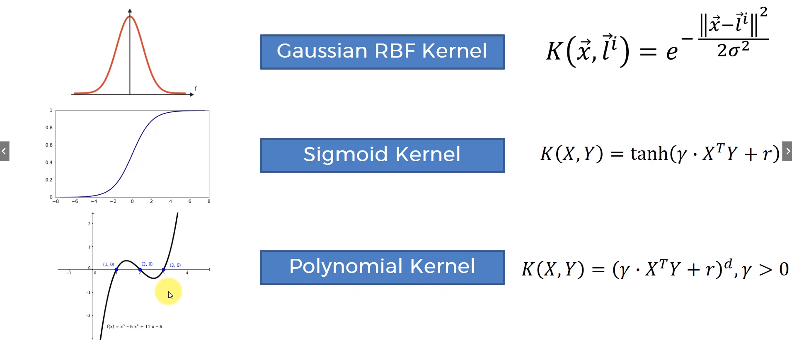

# Kernel SVM

## Description

- The goal of SVM is to find a decision boundary that best separates the data into different classes.

- In the above image, for the first case, we can draw a line that separates the data into two classes. This is called a `linearly separable data`. For the second case, we cannot draw a line that separates the data into two classes. This is called a `non-linearly separable data`.

- To use SVM for non-linearly separable data, we can use a **`kernel trick`**. This is **a mathematical technique that transforms the data into a higher dimension, where it becomes linearly separable**.

### Example: 🤔

- In the above image, we can see that the data is non-linearly separable. We can use a kernel trick to transform the data into a higher dimension, where it becomes linearly separable.

- Now, we can draw a line that separates the data into two classes.

---

## Kernel Functions

- There are many kernel functions. The most common ones are:

  - `Linear Kernel`
  - `Polynomial Kernel`
  - `Radial Basis Function Kernel`, also called the `Gaussian Kernel`
  - `Sigmoid Kernel`

