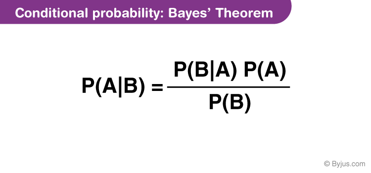

# Naive Bayes 😎

## What is Naive Bayes?

Naive Bayes is a classification algorithm based on Bayes' Theorem. It is called "Naive" because it makes the assumption that the features are independent of each other (which is mostly not the case). This is a very strong assumption, but it turns out that it works surprisingly well in practice.

## Bayes' Theorem

**Bayes' Theorem is a way of calculating the probability of an event, based on prior knowledge of conditions that might be related to the event**. 

- For example, if the probability of cancer in the general population is 1%, and the probability of a positive mammogram given that you have cancer is 90%, then the probability that you have cancer given that you have a positive mammogram is 90% (even though you only have a 1% chance of having cancer to begin with).

## Naive Bayes Intuition

- We have the training dataset with the features and the labels.

- We **take a new data point and calculate the probability of that data point being in each of the classes**.

- We **take the class with the highest probability**.

- To calculate the probability, use **`Bayes' Theorem`**.

