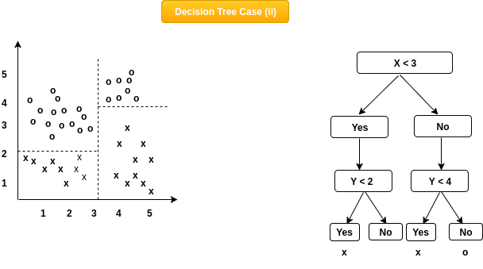

# Decision Tree Classification 🌲

 A Decision tree is a flowchart-like tree structure, where each internal node denotes a test on an attribute, each branch represents an outcome of the test, and each leaf node (terminal node) holds a class label.



- Split the dataset into multiple subsets.
- Split the subsets into multiple subsets.
- Continue this process until the subsets are pure.
- The subsets are pure when they contain only one class of data.
- Then generate a decision tree based on the subsets.
- **When a new data point comes, it will be classified based on the decision tree, and to which ever class it falls into, `the class with highest frequency in that subset` will be the predicted value.**

---

### A sample decision tree graph


---

#### It works best when the dataset is non-linear, and there're multiple features.


---

## Code:

```python
from sklearn.tree import DecisionTreeClassifier
classifier = DecisionTreeClassifier(criterion = 'entropy', random_state = 0)
classifier.fit(X_train, y_train)
print(classifier.predict(sc.transform([[30,87000]])))
```