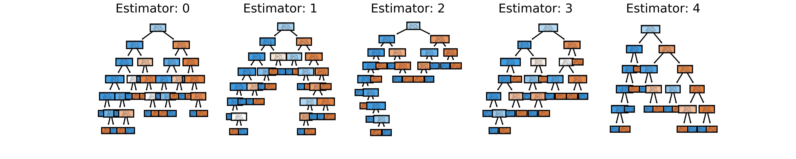

# Random forest classification 🌳🎄



- **Random forest is a version of `Ensemble Learning`**.

- Ensemble Learning is a machine learning technique that combines several base models in order to produce one optimal predictive model.

- When you take multiple algorithms or the same algorithm multiple times and you put them together that results in a much more powerful version.

---

## Properties:

- Random forest is a collection of decision trees.
- It creates multiple decision trees and merges them together to get a more accurate and stable prediction.
- It is a non-linear model.
- It is a non-continuous model.
- It is a non-parametric model.

---

## How does it work?

- First of all, pick at random K data points from the training set.

- Then build the decision tree associated to these K data points.

- Choose the number Ntree of trees you want to build and repeat steps 1 and 2.

- **For a new data point, make each one of your Ntree trees predict the value of Y for the data point in question, and assign the new data point to the category that wins the majority vote**.

- and, that is our final prediction.

---

## Code:

```python
from sklearn.ensemble import RandomForestClassifier

# n_estimators is the number of trees in the forest.
# random_state is the seed used by the random number generator. (so that we will generate same trees every time)
classifier = RandomForestClassifier(n_estimators = 10, criterion = 'entropy', random_state = 0)
classifier.fit(X_train, y_train)
print(classifier.predict(sc.transform([[30,87000]])))
```