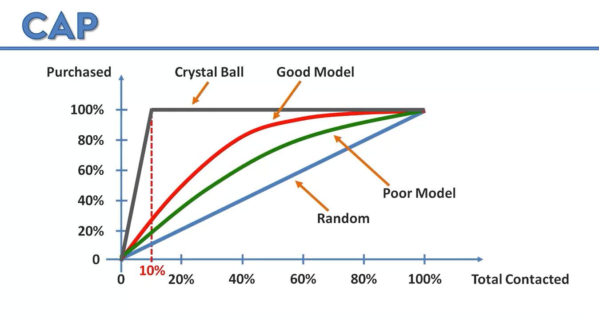
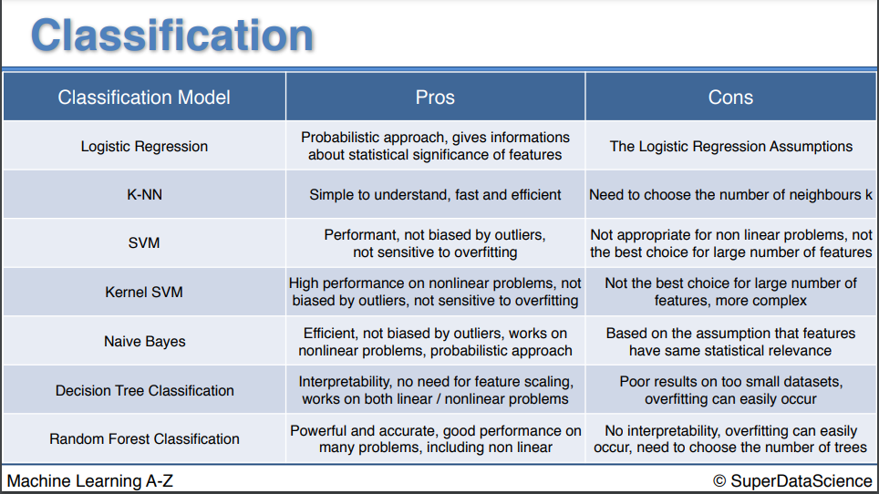

# Evaluating classification model performance 💃

## Confusion matrix 😕

- [Youtube video](https://www.youtube.com/watch?v=AyP85ocS-8Y) for confusion matrix.

- A confusion matrix is a table that is often used to describe the performance of a classification model (or "classifier") on a set of test data for which the true values are known.

- **True Positive (TP):** We predict a label of 1 (positive), and the true label is 1.

- **True Negative (TN):** We predict a label of 0 (negative), and the true label is 0.

- **False Positive (FP):** We predict a label of 1 (positive), but the true label is 0. Also known as a **"Type I error"**.

- **False Negative (FN):** We predict a label of 0 (negative), but the true label is 1. Also known as a **"Type II error"**.

- **Accuracy:** Overall, how often is the classifier correct.

- **Accuracy rate:** (TP + TN) / (TP + TN + FP + FN)

- **Error rate:** (FP + FN) / (TP + TN + FP + FN)

---

## Accuracy paradox:

- **Accuracy paradox:** If you have a skewed dataset, then accuracy is not a good metric to use.

- In such cases, even if your model is predicting all the values as 0, it will still have a high accuracy.

- For example, if you have a dataset with 90% of the values as 0, and 10% of the values as 1, then if you predict all the values as 0, then your accuracy will be 90%.

- So, we use **CAP** (Cumulative Accuracy Profile analysis) to solve this problem.

- [Read a blog post about CAP](https://www.geeksforgeeks.org/python-cap-cumulative-accuracy-profile-analysis/)

- [Youtube video on CAP](https://www.youtube.com/watch?v=reiZ61V2OlI)

---

# How to choose the best model?

- you first need to figure out whether your problem is linear or non linear.

- If your problem is linear, you should go for Logistic Regression or SVM.

- If your problem is non linear, you should go for K-NN, Naive Bayes, Decision Tree or Random Forest.

### From a business point of view, you would rather use:

- **Logistic Regression** or **Naive Bayes** when you want to rank your predictions by their probability. For example if you want to rank your customers from the highest probability that they buy a certain product, to the lowest probability. Eventually that allows you to target your marketing campaigns. And of course for this type of business problem, you should use Logistic Regression if your problem is linear, and Naive Bayes if your problem is non linear.

- **SVM** when you want to predict to which segment your customers belong to. Segments can be any kind of segments, for example some market segments you identified earlier with clustering.

- **Decision Tree** when you want to have clear interpretation of your model results,

- **Random Forest** when you are just looking for high performance with less need for interpretation. 

---

## Pros and cons of the different models:
