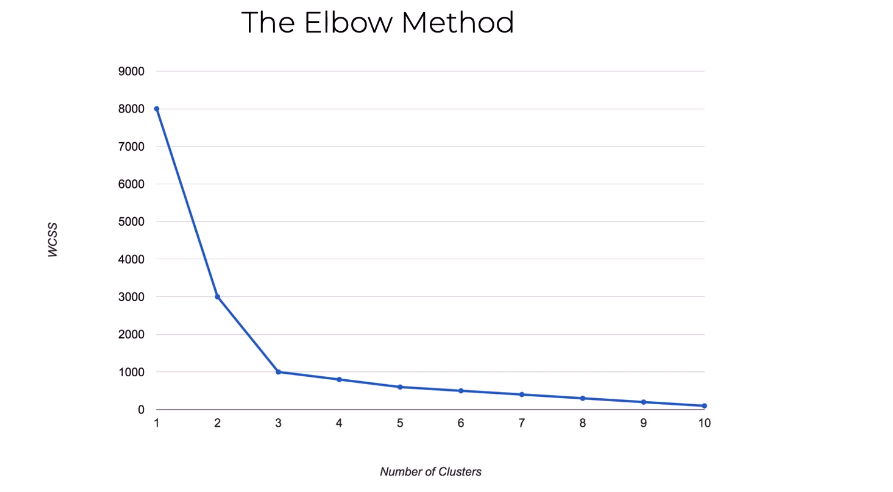
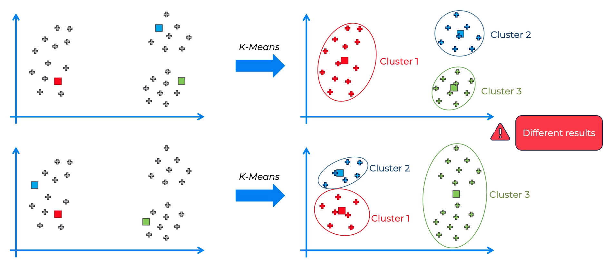
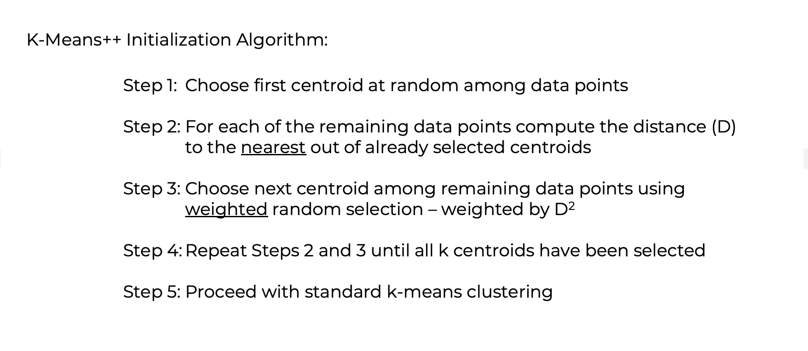
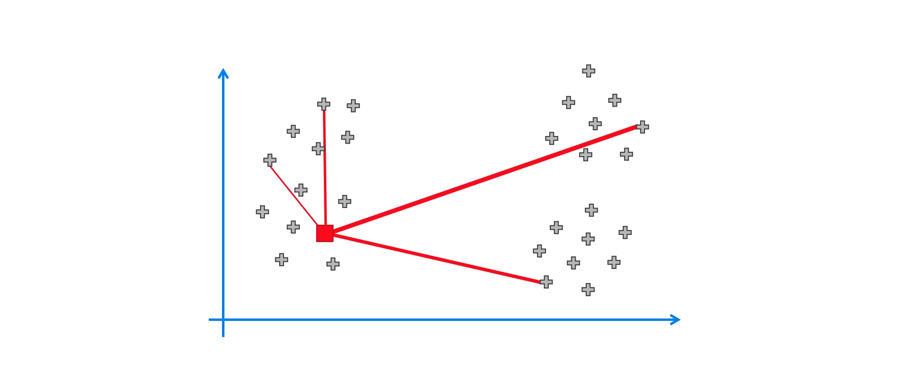
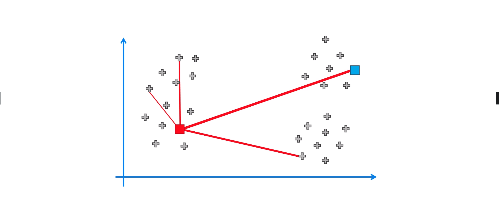
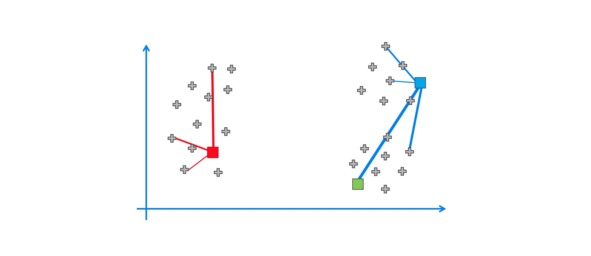
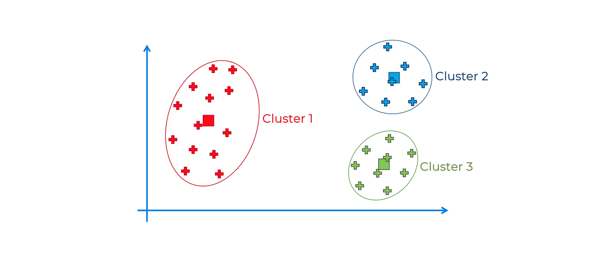

# K means clustering ⛱️

## Introduction

`K means clustering` is a simple **`unsupervised machine learning algorithm`** that **groups data points into k clusters**.

The algorithm works iteratively to assign each data point to one of k groups based on the features that are provided. Data points are clustered based on feature similarity.

The **results of the K-means clustering** algorithm are:

* The **centroids of the k clusters, which can be used to label new data**

* **Labels for the training data (each data point is assigned to a single cluster `(nearest cluster)`)**

---

## Algorithm

The **K-means algorithm identifies k number of centroids, and then allocates every data point to the nearest cluster, while keeping the centroids as small as possible**. The `means` in the K-means refers to averaging of the data; that is, finding the centroid.

- ***The ‘means’ is arrived at iteratively. The ‘means’ is the point at which the sum of the squared distance of the points from the cluster’s centroid is at its minimum.***

---

### But, how do we find the optimal value of k?

- ***The optimal value of k is the one that gives the best clustering results.***

- We start with '1' cluster, and find its sum of squared errors (SSE). Then, we increase the number of clusters, and find the SSE for each value of k. The **optimal value of k is the one that gives the lowest SSE**.

##### WCSS (Within Cluster Sum of Squares) -> WCSS is defined as the sum of the squared distance between each member of the cluster and its centroid.

- We find WCSS for each value of k, and plot it against the value of k.

- For one single cluster (i.e., k=1), the WCSS will be maximum.

- For a cluster with the same number of data points as the total number of data points, the WCSS will be minimum (i.e., 0).

- But, we definitely can't have a cluster with the same number of data points as the total number of data points. So, we choose the value of k at the **elbow point**.

- So, **`the optimal value of k is the one after which the rate of decrease in WCSS is very low`**. In the above image, it will be 3.

---

## K-means++ (random initialization trap)

- ***The K-means algorithm is very sensitive to the initial values of the centroids.***

- ***If the initial values are not chosen properly, the algorithm may converge to a local minimum, and not the global minimum.***

- ***This is called the `random initialization trap`.***

- ***To avoid this, we use the K-means++ algorithm.***

- ***In this algorithm, the initial values of the centroids are chosen in such a way that they are far away from each other.***

- This is done to avoid the `random initialization trap`. 

- ***K-means++ algorithm doesn't guarantee that it will converge to the global minimum, but it is very unlikely that it will converge to a local minimum***.

---

### Steps to implement K-means++ algorithm:

- ***Step 1: Choose the number of clusters k. (lets say 3)***

- ***Step 2: Select at random one data points from the dataset.***

- ***Step 3: Calculate the distance of the selected data point from all the other data points.***

- ***Step 4: Select the data point with the maximum distance from the previously selected data point, as another centroid.***

- ***Step 5: Repeat steps 3 and 4 until k data points are selected.***

- ***Step 6: Now, we have k data points that are the initial centroids.*** Now, we can follow the same steps as the K-means algorithm.

