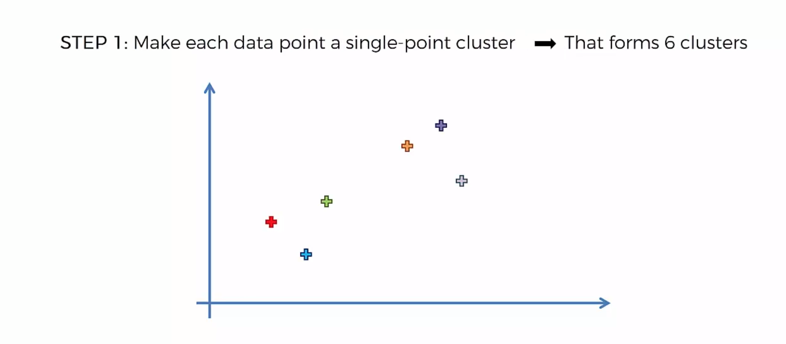

# Hierarchical Clustering 😎

Hierarchical clustering is a popular method for grouping objects. It creates groups so that objects within a group are similar to each other and different from objects in other groups. 

- *`Clusters are visually represented`* in a hierarchical tree called a **`dendrogram`**.

### Hierarchical clustering has a couple of key benefits:

- There is no need to pre-specify the number of clusters.
- Instead, the dendrogram can be **`cut at the appropriate level to obtain the desired number of clusters`**.
- Data is easily summarized/organized into a hierarchy using dendrograms. 
- Dendrograms make it easy to examine and interpret clusters.

---

## Hierarchical clustering types:
There are two main types of hierarchical clustering:

#### Agglomerative (mostly used)

- Initially, each object is considered to be its own cluster.

- Then the merging process is performed step by step until all objects are in a single cluster.

### Merging process:

- **Step 0**:

- **Step 1**: Make each dataset a cluster.

- **Step 2**: Take the two closest data points and make them one cluster.

- **Step 3**: Take the two closest clusters and make them one cluster.

- **Step 4**: **But, how do we know which two clusters are the closest?**

This is also called **`linkage`**. Some of the most common linkage methods are:

- **`Single Linkage`**: The distance between two clusters is the distance between the closest points in each cluster.

- **`Complete Linkage`**: The distance between two clusters is the distance between the farthest points in each cluster.

- **`Average Linkage`**: The distance between two clusters is the average distance between all points in each cluster.

- **`Centroid Linkage`**: The distance between two clusters is the distance between the centroids of each cluster.

- **`Ward Linkage`**: The distance between two clusters is the increase in within-cluster sum of squares if we were to merge the clusters.

- **Step 5**: Repeat step 3 until there is only one cluster left.

- At the end of the cluster merging process, a cluster containing all the elements will be formed.

#### Divisive

- The Divisive method is the opposite of the Agglomerative method.

- Initially, all objects are considered in a single cluster.

- Then the division process is performed step by step until each object forms a different cluster. 

- The cluster division or splitting procedure is carried out according to some principles that maximum distance between neighboring objects in the cluster.

---

- After we have got the dendrogram, we can cut it at the appropriate level to obtain the desired number of clusters. 

- Then we can assign each object to the cluster to which it belongs.