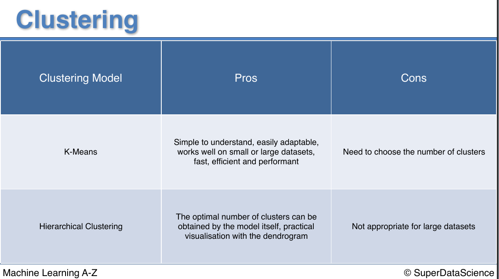

# Clustering

- Clustering is an **unsupervised learning** technique.

- Clustering is similar to classification, but the basis is different.

- In Clustering you don’t know what you are looking for, and you are trying to identify some segments or clusters in your data.

- When you use clustering algorithms on your dataset, unexpected things can suddenly pop up like structures, clusters and groupings you would have never thought of otherwise.

In this part, you will understand and learn how to implement the following Machine Learning Clustering models:

1. [K-Means Clustering](./01_k_means_clustering/)
2. [Hierarchical Clustering](./02_hierarchical_clustering/)

---

## K-means Clustering Vs Hierarchical Clustering

