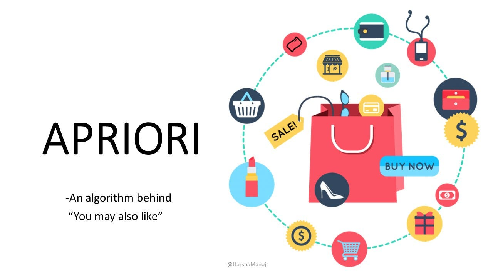
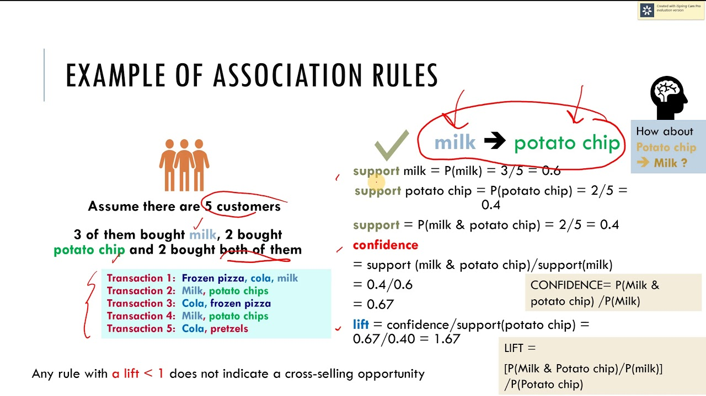

# Apriori - Association rule learning 🛒

Apriori is an algorithm for learning association rules. It is a **greedy algorithm** that finds all the subsets of a frequent itemset and then tries to find a larger frequent itemset by combining those subsets. It is a **bottom-up** approach.

---

## Terminology

- **Support** - The support of an itemset is the proportion of transactions in the dataset that contain the itemset. It is calculated as the number of transactions containing the itemset divided by the total number of transactions. (**probability of the itemset occurring in the dataset**)

- **Confidence** - **Of all the people who have bought an item X, what is the probability that they will also buy an item Y?** It is calculated as the number of transactions containing both X and Y divided by the number of transactions containing X. (**probability of the item Y being bought given that the item X is bought**)

- **Lift** - ***Ratio of the confidence to the support**. We can think of it as the lift (or increase) in the probability of buying Y when we know that X has been bought compared to the probability of buying Y without knowing whether X has been bought or not.** It is calculated as the confidence of X and Y divided by the support of Y. (**measure of the correlation between X and Y**)

---

## Apriori algorithm

1. Set a minimum support and confidence.

2. Take all the subsets in transactions having higher support than minimum support.

3. Take all the rules of these subsets having higher confidence than minimum confidence.

4. Sort the rules by decreasing lift.

---

## Notes:

- **Generally, the higher the support and confidence, the better the rule.**

- **The lift of a rule tells us how much better the rule is than a random guess.** If the lift is greater than 1, the rule is better than random. If the lift is less than 1, the rule is worse than random.

- **`Lift of 3 or more is considered good`**.🏋️

- **`Lift of 1 means that the rule is no better than random`**.

- ***Minimum support and confidence are usually set to 0.3 and 0.8 respectively. But, they can be set to any value depending on the problem.***