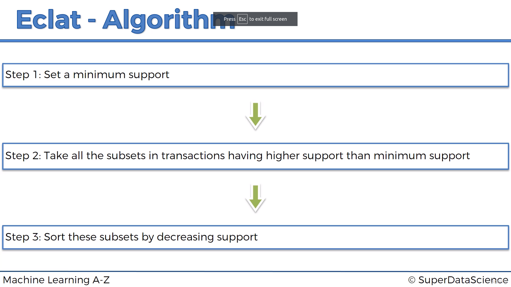

# Eclat (Equivalence Class Clustering and Bottom-Up Lattice Traversal) - association rule learning 🛒

- Eclat is an algorithm for learning association rules.

- Eclat stands for **Equivalence Class Clustering and Bottom-Up Lattice Traversal**

- Eclat is faster than Apriori because it does not need to generate candidate itemsets.

- It only uses **support** to find frequent itemsets. It does not use **confidence** or **lift**.

- We were using **Lift** in Apriori to find the best rules. But in Eclat, we are only using **support**. This is the one down-side of Eclat. So, we need to choose the best rules using **support**. **This downside also makes it faster than Apriori**.

---

## Algorithm

1. Set a minimum support.

2. Take all the subsets in transactions having higher support than minimum support. For example, if the minimum support is 0.003, then we will take all the subsets having support greater than 0.003. **All the subsets means `1-itemsets`, `2-itemsets`, `3-itemsets`, are appearing how many times together in the dataset. Find their support and take the ones having support greater than 0.003.**

3. Sort the rules by decreasing support.

---

