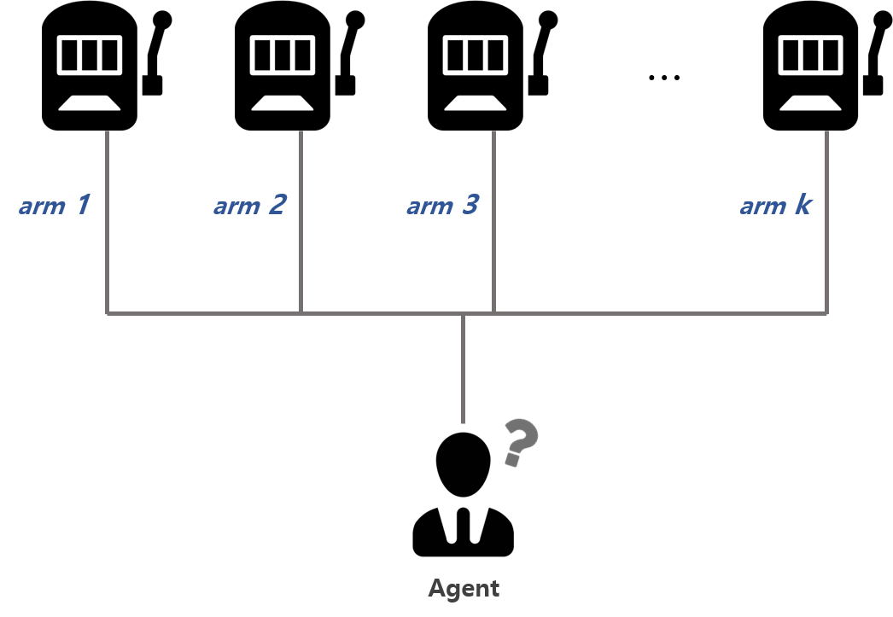
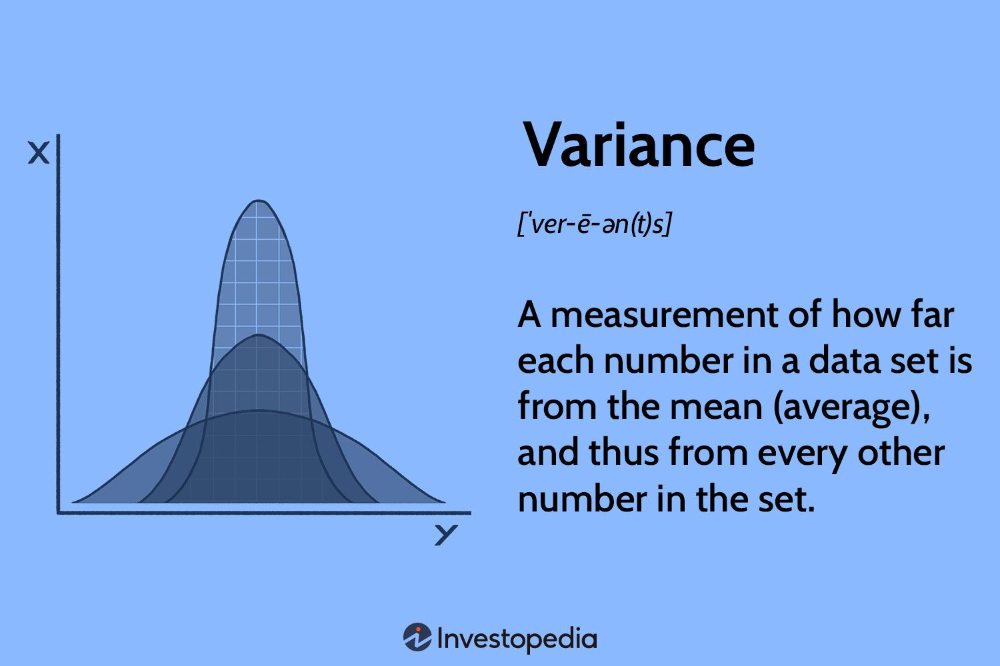
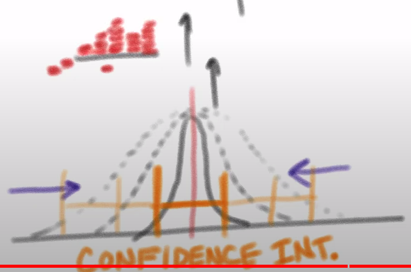
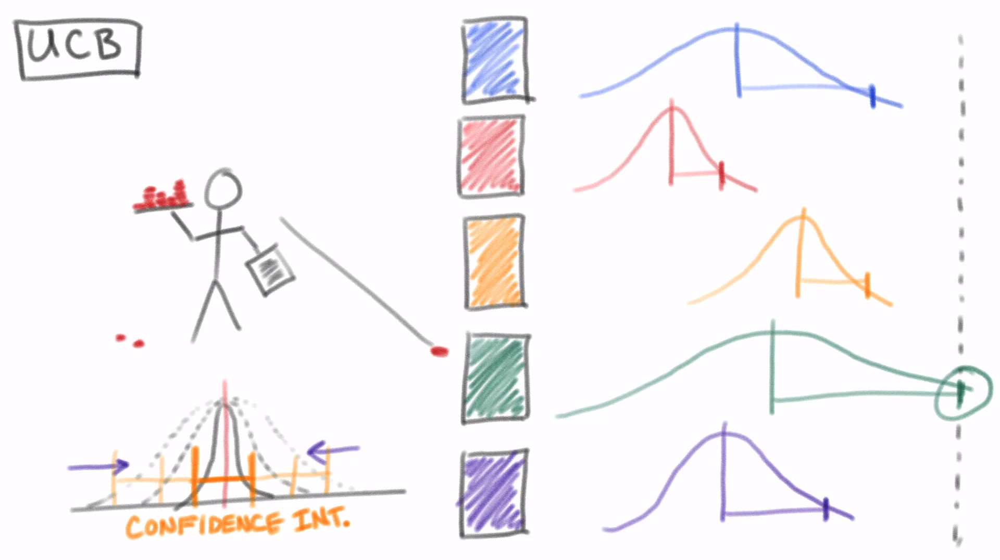
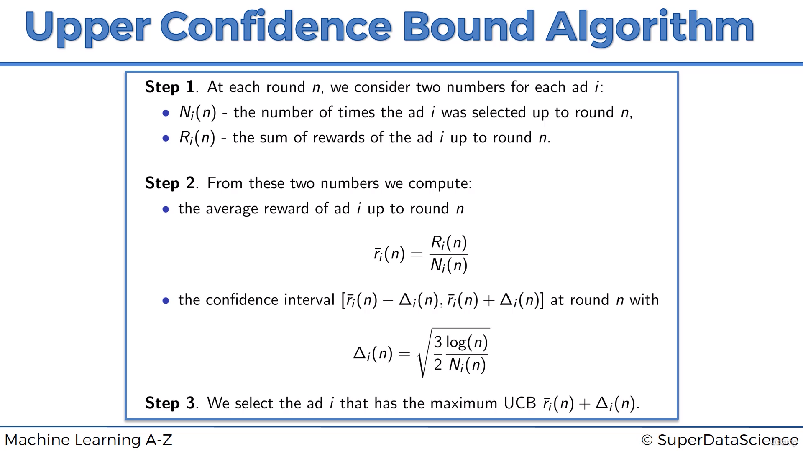

# Upper confidence bound 🗽

## Multi-armed bandit problem 🎰

- The multi-armed bandit problem is a problem in decision theory, in which a fixed limited set of resources must be allocated between competing (alternative) choices in a way that maximizes their expected gain, when each choice's properties are only partially known at the time of allocation, and may become better understood as time passes or by allocating resources to the choice.

- Each bandit has a different probability of winning, and the goal is to maximize the total reward by choosing the best bandit.

- But, we don't know the probability of winning for each bandit.

- So, we have to explore the bandits multiple times to find the one with best probability, and then exploit the best bandit to maximize the total reward.

- But, we can't explore each bandit infinitely, because we have limited resources.

- So, we have to find a balance between **exploration** and **exploitation**.

---

## Upper Confidence Bound (UCB) 🎯

- To tackle the multi-armed bandit problem, we can use the Upper Confidence Bound (UCB) algorithm.

- `General approach will be to, explore each bandit at least once or a few times, and then exploit the bandit with best average reward`.

- But, what if we have a bandit with a very high average reward, but unfortunately, when we explored it, we got a very bad reward.

- So, instead of only using best average reward, we will also **explore their variance**.

- The **more number of times we explore a bandit, more accurately we can predict its average range**.

- So, we will use the **average + confidence interval** to find the upper bound of the average reward.

- The **higher the sum of average & confidence interval, the more we will explore the bandit**.

---

## Algorithm 📝

- `After each round, the confidence interval will decrease, indicating more accurately we can predict the average reward`.

- Our selection for the next round will be the bandit with the **highest upper bound**.