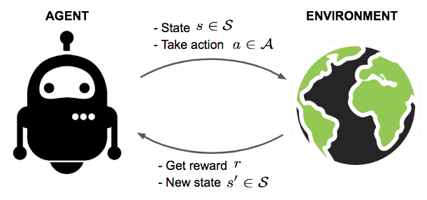
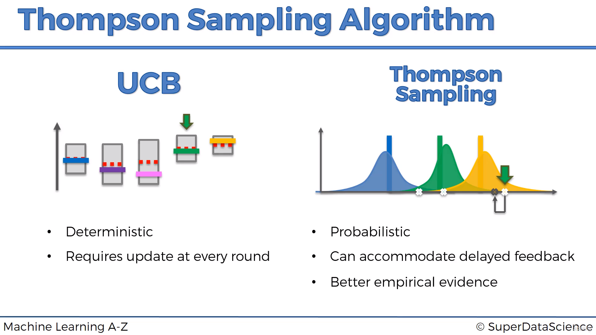

# Reinforcement learning 🤖

- Reinforcement Learning is a powerful branch of Machine Learning.

- It is used to solve interacting problems where the data observed up to time t is considered to decide which action to take at time t + 1.

- It is also used for Artificial Intelligence when training machines to perform tasks such as walking.

- `Desired outcomes provide the AI with reward, undesired with punishment. Machines learn through trial and error`.

--- 

In this part, you will understand and learn how to implement the following Reinforcement Learning models:

1. [Upper Confidence Bound (UCB)](./01_upper_confidence_bound/)

2. [Thompson Sampling](./02_thompson_sampling/)

---

## UCB vs Thompson Sampling

