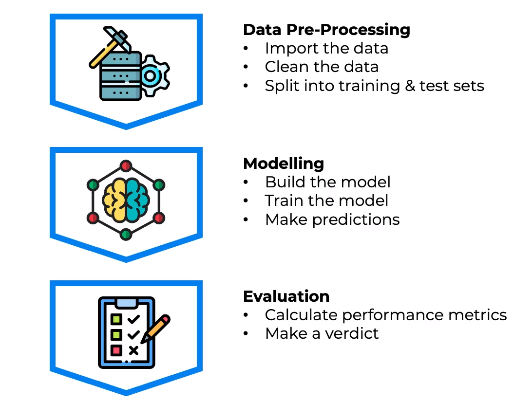

# Machine learning rocket 🚀

---

## => Introduction

### Machine learning workflow:

### But, why split data into 'train data' and 'test data'?

So that we can test our model on data it has never seen before. If we train our model on the same data we test it on, we will get a very high accuracy score, but it will not be able to generalize to new data. This is called **overfitting**.

### What is overfitting?

Overfitting is when a model fits the training data too well. It is able to predict the training data very well, but it is not able to generalize to new data. This is because the model is too complex and is learning the noise in the data.

### What is underfitting?

Underfitting is when a model does not fit the training data well enough. It is not able to predict the training data very well, and it is also not able to generalize to new data. This is because the model is too simple and is not learning the patterns in the data.

### How do we know if our model is overfitting or underfitting?

We can use the **train-test split** to find out. If the model performs well on the training data, but not on the test data, then it is overfitting. If the model performs poorly on both the training data and the test data, then it is underfitting.

---

## Contents:

### 1. [Data preprocessing](./01_data_preprocessing//)

### 2. [Regression](./02_regression/)

### 3. [Classification](./03_classification/)

### 4. [Clustering](./04_clustering/)

### 5. [Association rule learning](./05_association_rule_learning/)

### 6. [Reinforcement learning](./06_reinforcement_learning/)